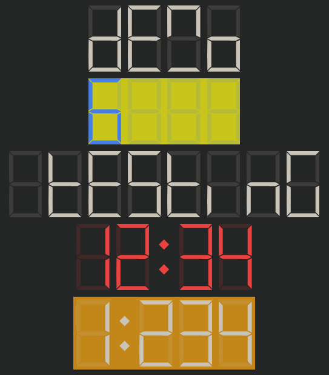

# 7 Segment Display Web Component by [@dancing-lizard](https://www.github.com/dancing-lizard)

[![GitHub Release][releases-shield]][releases]
[![License][license-shield]](LICENSE.md)

Web Component inspired by 7 segment led/lcd displays

Based on work by thomas (https://codepen.io/thmsdnnr/pen/JMWPOM)

Features:

-   Selectable size
-   Foreground and background colors

## Usage

See index.html for usage examples

[license-shield]: https://img.shields.io/github/license/dancing-lizard/fancy-light-card.svg?style=for-the-badge
[releases-shield]: https://img.shields.io/github/release/dancing-lizard/fancy-light-card.svg?style=for-the-badge
[releases]: https://github.com/dancing-lizard/fancy-light-card/releases
